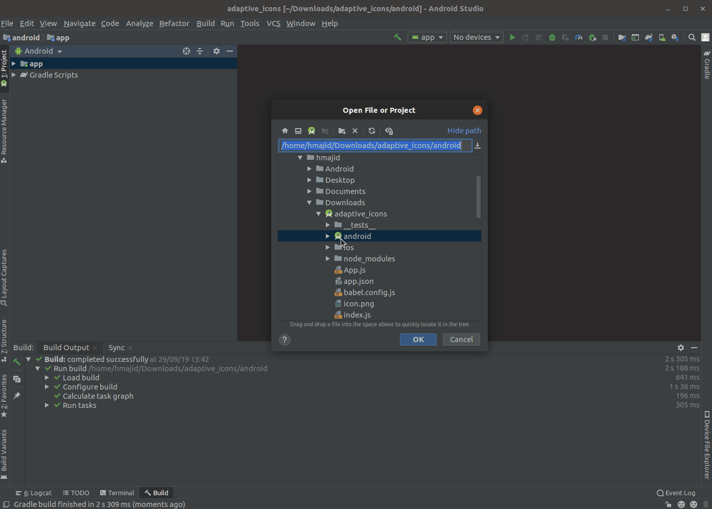
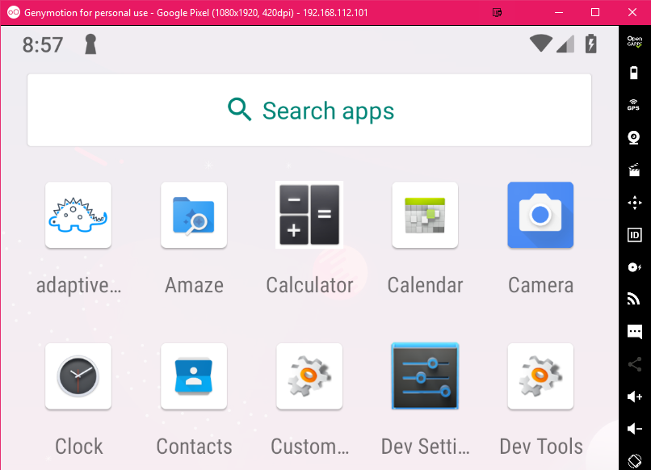

In this article, we will go over how you can use add the "new" adaptive app icons to your Android app.
In his article I will be using a React Native project, so the structure of your Android app may vary.


---

## Adaptive Icons

Adaptive icons are a new feature introduced in Android 8.0 (API level 26). It allows your app icon
to be displayed using multiple shapes across different devices and launchers, more
information available [here](https://developer.android.com/guide/practices/ui_guidelines/icon_design_adaptive).
The main advantage of using adaptive icons is so that we don't have to have to create multiple icons, i.e. round and square
versions of your app icon. You provide two layers, a foreground and the background which is usually just a colour.

### Android Studio

To add adaptive icons to your application do the following;

- Open your application in Android Studio (If it's a React Native application make sure to open the `android` folder in Android Studio)
- Right-click on the `app` folder
- File > New > Image Asset
- On the first tab "Foreground Layer" click on `path` and select your icon (resize the icon as required)
- Select the second tab "Background Layer" select `Asset Type: Color` and select the colour you would like to use
- Select `Next` (bottom right)
- Select `Finish`



You can find the new files in `android/app/src/main/res` sub-folders

### Test

You can test it works, if you're using the example source code found
[here](https://github.com/hmajid2301/medium/tree/master/16.%20Add%20Adaptive%20Icons%20to%20your%20Android%20App).

Run the following commands

```bash
adb connect xxx.xx.xxx.xx # IP Address of your emulator
yarn
yarn run start
yarn run android # In another terminal
```

Then you should see something like the image below instead of the default green Android robot.



---

## Appendix

- [Example source code](https://github.com/hmajid2301/medium/tree/master/16.%20Add%20Adaptive%20Icons%20to%20your%20Android%20App)
- [Android Asset Studio](https://romannurik.github.io/AndroidAssetStudio/index.html)
- [Cover Photo from UpLabs](https://www.uplabs.com/posts/adaptive-icons-for-android-o)
