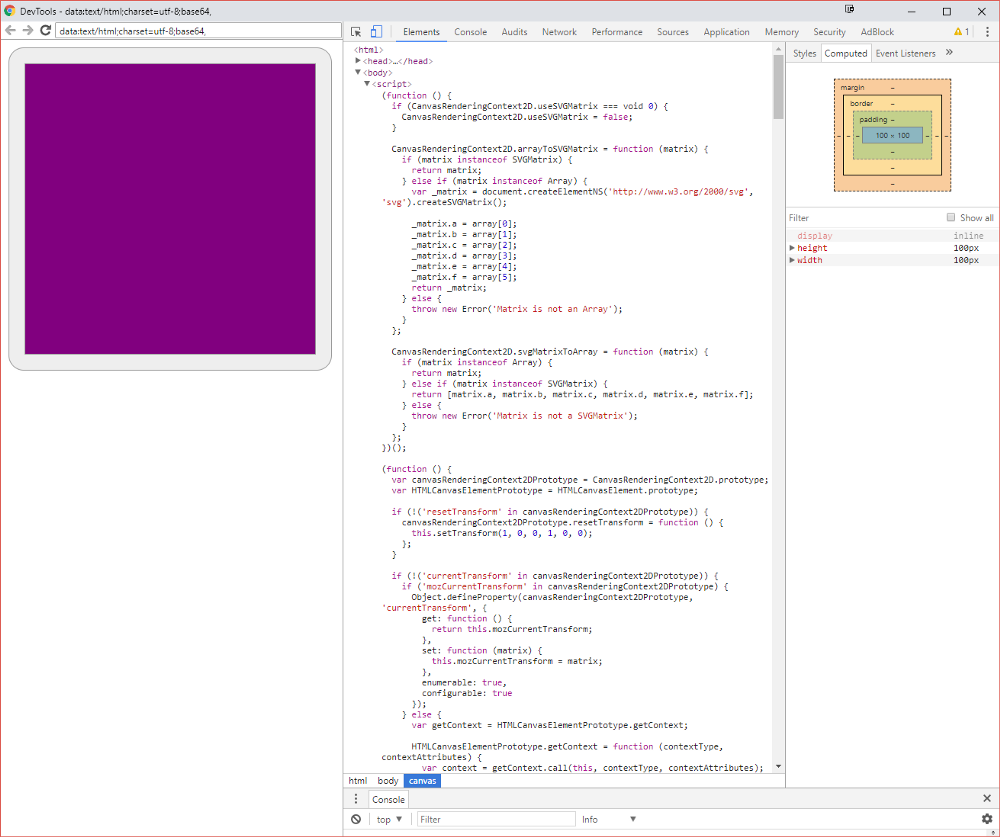
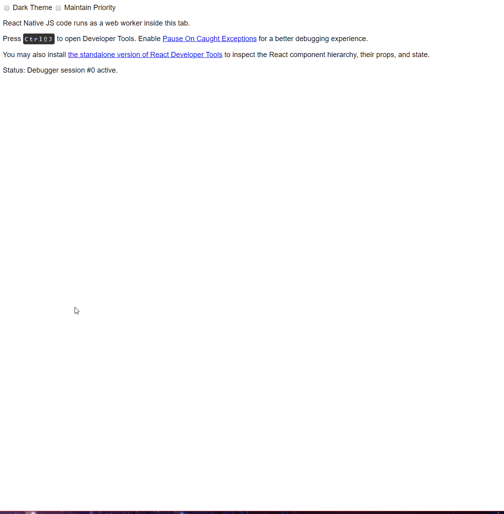

The _core_ logic of my React Native app involves using WebViews because I need to access the HTML5 canvas. Whilst
developing this code there are bound to be errors and issues with the WebView code. Figuring out how to debug
code within the WebView isn’t so obvious.

---

## Option 1: Chrome Inspect

- Start your Expo/React Native app\*.
- Open and chrome and then go to the following URL, [chrome://inspect](chrome://inspect).
- Then click on the _inspect_ button, click the top link to open the latest WebView, you should see something similar to Figure 2.
- You should see something similar to Figure 1. Now you explore the WebView like a normal web page.

## Option 2: React Native Debugger

Alternatively you can access this page using the React Native Debugger page in chrome.

- Start your Expo/React Native app\*
- Go to your React Native debugger on chrome, in my case since I’m using Expo my URL is http://192.168.27.128:19001/debugger-ui/
- Go to the three dots button (next to close button) > More tools > Remote devices
- At the bottom you’ll see another panel open up
- You should be able to see your Android device in the list
- Hit the Inspect button the first item (this will be the latest)
- Now you explore the WebView like a normal web page

---

## Debugging

So to the closest way to debug the WebView I have found is to use console.log statements that will appear in the
DevTools console. In the normal React Native debugger console you won’t be able to see any console.log statements
from the WebView. You can only view them by exploring DevTools for Remote devices. As far as I can tell you cannot
use breakpoints in WebViews but still this is better than nothing.

---

## Appendix

Make sure to do this on the same machine/host that is running the emulator. For example, a Genymotion VM is
running on my Windows machine but I can still see it’s WebViews on the chrome inspect URL. This can be seen in Figure 3.

### Links

- [With help from this StackOverflow post](https://stackoverflow.com/questions/47711418/debugging-webview-in-react-native-apps?rq=1)
- [Genymotion](https://www.genymotion.com/)
- GIFs created with [screentogif](https://www.screentogif.com/)
