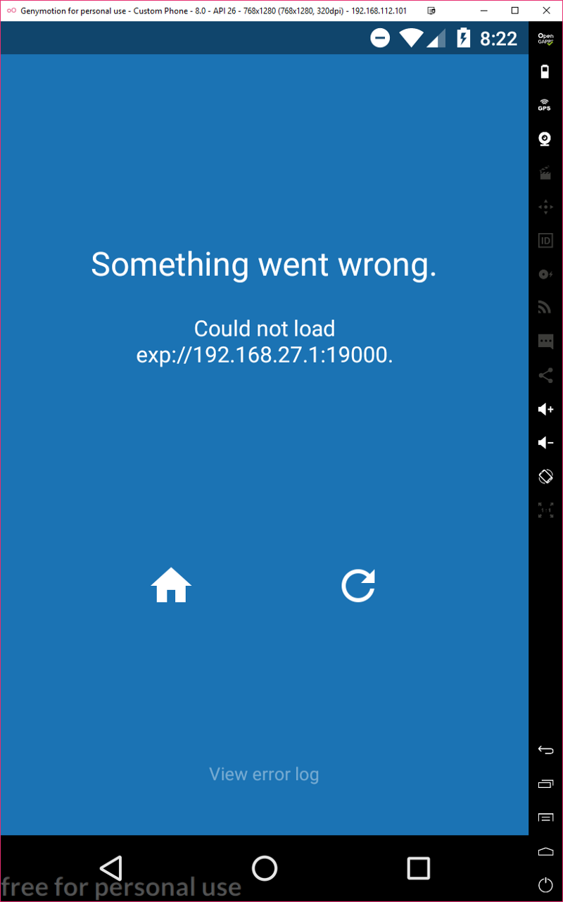

Running Expo/React Native in a Docker container can sometimes cause issues. In this example, I will be running
Docker 🐳 within a guest VM (Ubuntu) which will run on my host machine (Windows). My host machine will also
be running another VM as the Android emulator (Genymotion) for Expo to connect to. You can get a more
detailed post about how to connect two VMs together
[here](https://medium.com/@hmajid2301/react-native-expo-with-virtualbox-and-genymotion-2b58f622d92b),
#Plug 🔌🔌🔌. Since I’ve set up networking on those two VMs already as far as Expo is concerned
it might as well be running on the host machine (Windows). Also in this example, I will be testing
this on an Android device.


## Prerequisites

- [Install Docker](https://docs.docker.com/install/)
- (optional) [Install docker-compose](https://docs.docker.com/compose/install/)
- Android device/emulator to test on

## Docker

```json:title=package.json file=./source_code/package.json

```

The `package.json` file I will be using the following example is a very barebones file, just including the minimum
packages required to run Expo.

```docker:title=Dockerfile file=./source_code/Dockerfile

```

`FROM node:latest`

Tells us which Docker Image we are using as a base, in this case, the official node.js image. This is because it
will have a lot of the dependencies we need already installed such as yarn and npm.

```text
ENV ADB_IP="192.168.1.1"
ENV REACT_NATIVE_PACKAGER_HOSTNAME="192.255.255.255"
```

Sets an environment variable which can be accessed during runtime of the Docker container. Strictly speaking, these
don’t need to be here because we can always inject into the Docker container at runtime, but I like to have the
environment variables documented.

The **ADB_IP** is IP of the Android device 📱 to connect to. The **REACT_NATIVE_PACKAGER_HOSTNAME** environment variable is
very important because it sets which IP address Expo (cli) is running on, this is the IP Address your phone will try to
connect to. If this is not set correctly, you’ll get an error similar to Figure 1. You can work out the correct IP
address on Linux by using the following command. The first one should host IP (192.168.27.128 on my machine).

```bash
hostname -I
192.168.27.128 192.168.130.128 172.17.0.1 172.19.0.1 172.18.0.1
```

The reason this environment variable needs to be set is because by default the React Native packager
(which expo relies on) picks the first IP it sees on the machine, hence you can run expo on your host machine
fine but when you run in a Docker container you cannot connect to it because it’s trying to use the Docker
IP address (one of the ones starting with 172.xxx.xxx.xxx).

```text
EXPOSE 19000
EXPOSE 19001
```

This is essentially meta data letting the user of the Docker container know that they can access data on those ports.

```bash
RUN apt-get update && \
    apt-get install android-tools-adb
```

Install Android Debugging Bridge (ADB), which is used to connect to an Android device and debug the application.

```text
COPY package.json yarn.lock app.json ./
RUN yarn --network-timeout 100000
```

Copy some important files from host to Docker container. The `package.json` and `yarn.lock` are used to install
the dependencies and `app.json` is required by expo as a bare minimum.

```text
CMD adb connect $ADB_IP && \
    yarn run android
    # runs expo-cli start --android
```



## Running Docker

This command runs when the Docker Image is first to run, every other command is used to build to the image itself. This
uses an environment variable passed into the Docker container and connects to the Android device at \$ADB*IP. Then run
the **android** command in \_package.json*. Then you can simply run the following commands to build and start your Docker container.

```bash
docker build -t expo-android .
docker run -e ADB_IP=192.168.112.101 \
            -e REACT_NATIVE_PACKAGER_HOSTNAME=192.168.1.1 \
            -p 19000:19000 \
            -p 19001:19001 \
            expo-android
```

- -t is used to name the image (expo-android)
- . tells Docker where the Dockerfile is (in the current directory)
- --env sets environment used by Docker container when it starts to run (REACT_NATIVE_PACKAGER_HOSTNAME andADB_IP are overwritten using these new values)
- -p publishes ports, in this example, it maps port 19000 on the host to port 19000 on the Docker container (and also 19001), as we need to access port 19000 and 19001 so that Expo (expo-cli) can connect to our Android device.

```yaml:title=docker-compose.yml file=./source_code/docker-compose.yml

```

Since expo is being used to build mobile phone applications Docker isn't going to be used in production. I prefer to use
docker-compose to do the building and running, it means I can run one simple command and do the building and running in
one step. Quick aside docker-compose is great for development, especially when you need to run multiple Docker container,
but is not really built to be used in production. Look at using a container orchestration tool such as Kubernetes.

I also mount my current directory on the host machine to /app/ directory on the docker container, this is so that any
files that change on my the host machine will also change in the Docker container, rather than having to build the
Docker container again.

```bash
docker-compose up --build -d
```

### Environment Variables

```text:title=.env file=./source_code/.env

```

An example `.env` file used to pass environment variables (using docker-compose) to the Docker container.

## Appendix

- [Example source code](https://gitlab.com/hmajid2301/articles/-/tree/master/5.%20Running%20Expo%20in%20Docker/source_code)
- [Docker explained](https://medium.freecodecamp.org/a-beginner-friendly-introduction-to-containers-vms-and-docker-79a9e3e119b)
- [GitHub issue around could not connect errors](https://github.com/react-community/create-react-native-app/issues/81)
- [Genymotion emulator](https://www.genymotion.com/)
- [GIF overlay creator (Nyan Docker)](https://ezgif.com/overlay)
- React logo from [here](https://seeklogo.com/vector-logo/273845/react)
